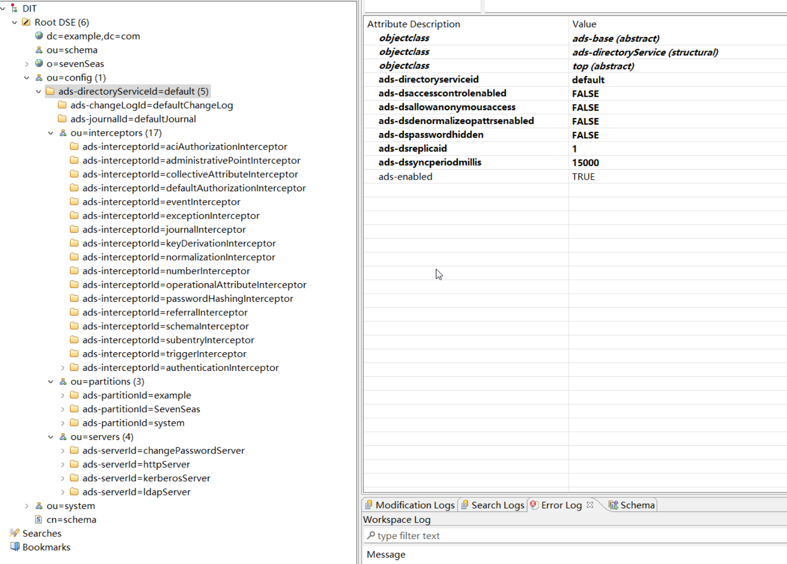

# 架构

了解服务器的工作方式

## 架构概览

Apache DS 体系结构层次：

如你所见，分为四个层次：

* 网络层 network
* 会话层 session
* 分区层 PartitionNexus
* 后端层 backend

以下逐渐介绍每个层的技术架构

## 网络层

我们不仅仅提供 LDAP 协议，还包含：

* Kerberos
* NTP
* DHCP
* DNS
* ChangePassword

它们都依赖 LDAP 的服务器作为后端存储：

* LDAP 服务需要 2 个 TCP 传输端口，默认为 10389，LDAPS 端口为 10636（中所周知的为 636）（LDAPS 已被视为弃用）
* Kerberos服务器使用一个TCP传输（默认为60088，但众所周知的端口是88）和一个UDP传输（两个端口的值相同）
* ChangePassword 服务器也使用一个TCP传输和一个UDP传输。默认值为60464，但众所周知的端口为464
* 我们也在运行 HttpServer，它用于管理。声明的端口都是TCP端口，一个用于HTTP，默认值为8080，另一个用于HTTPS，默认值是8443

## 目录服务

* 目录服务 DirectoryService 是服务器程序核心，处理所有传入的请求
* DirectoryService 有一个 schemaManager 示例，还有拦截器链 Interceptors
* DirectoryService 不仅仅是服务器的逻辑，它还保存每个客户端的当前状态

## 拦截器 

* 拦截器 Interceptors 是 DirectoryService 的特定功能，负责处理特定任务
* DirectoryService 接收的请求都将交由 Interceptors 处理，处理完成后再进入后端程序
* 拦截器可以禁用也可以启用，也可以添加新的拦截器

### 处理操作

以下为拦截器可以操作的子集：

|   Operation   |       Description        |
| :-----------: | :----------------------: |
|      add      |    添加 Entry 到后端     |
|     bind      |    添加绑定到目录服务    |
|    compare    | 将元素和后端元素进行比较 |
|    delete     |        删除 entry        |
|   getRooDSE   |     获取根节点 entry     |
|   hasEntry    |   告知 entry 是否存在    |
|    lookup     |        获取 entry        |
|    modify     |        修改 entry        |
|     move      |        移动 entry        |
| moveAndRename |    移动和重命名 entry    |
|    rename     |       重命名 entry       |
|    search     |       搜索 entries       |
|    unbind     |    跟目录服务解除绑定    |

### 已存在拦截器

以下拦截器已经存在服务中，但有些默认未启用，如下：

|            Interceptor            | Enabled | add  | bnd  | cmp  | del  | DSE  | has  | lkp  | mod  | mov  | m&r  | ren  | sea  | ubd  |
| :-------------------------------: | :-----: | :--: | :--: | :--: | :--: | :--: | :--: | :--: | :--: | :--: | :--: | :--: | :--: | :--: |
|    AciAuthorizationInterceptor    |   yes   |  X   |  -   |  X   |  X   |  -   |  X   |  X   |  X   |  X   |  X   |  X   |  X   |  -   |
|  AdministrativePointInterceptor   |   yes   |  X   |  -   |  -   |  X   |  -   |  -   |  -   |  X   |  X   |  X   |  X   |  ?   |  -   |
|     AuthenticationInterceptor     |   yes   |  X   |  X   |  X   |  X   |  X   |  X   |  X   |  X   |  X   |  X   |  X   |  X   |  X   |
|       ChangeLogInterceptor        |   yes   |      |  X   |  -   |  -   |  X   |  -   |  -   |  -   |  X   |  X   |  X   |  X   |  -   |
|  CollectiveAttributeInterceptor   |   yes   |  X   |  -   |  -   |  -   |  -   |  -   |  X   |  X   |  -   |  -   |  -   |  X   |  -   |
|  DefaultAuthorizationInterceptor  |   yes   |  -   |  -   |  -   |  X   |  -   |  -   |  X   |  X   |  X   |  X   |  X   |  X   |  -   |
|     DelayInducingInterceptor      |   no    |  -   |  -   |  -   |  -   |  -   |  -   |  -   |  -   |  -   |  -   |  -   |  X   |  -   |
|         EventInterceptor          |   yes   |  X   |  -   |  -   |  X   |  -   |  -   |  -   |  X   |  X   |  X   |  X   |  -   |  -   |
|       ExceptionInterceptor        |   yes   |  X   |  -   |  -   |  X   |  -   |  -   |  -   |  X   |  X   |  X   |  X   |  -   |  -   |
|        JournalInterceptor         |   yes   |  X   |  -   |  -   |  X   |  -   |  -   |  -   |  X   |  X   |  X   |  X   |  -   |  -   |
|     KeyDerivationInterceptor      |   no    |  X   |  -   |  -   |  -   |  -   |  -   |  -   |  X   |  -   |  -   |  -   |  -   |  -   |
|     NormalizationInterceptor      |   yes   |  X   |  X   |  X   |  X   |  -   |  X   |  X   |  X   |  X   |  X   |  X   |  X   |  -   |
|    NumberIncrementInterceptor     |   yes   |  X   |  -   |  -   |  -   |  -   |  -   |  -   |  -   |  -   |  -   |  -   |  -   |  -   |
|  OperationalAttributeInterceptor  |   yes   |  X   |  -   |  -   |  X   |  -   |  -   |  X   |  X   |  X   |  X   |  X   |  X   |  -   |
|    PasswordHashingInterceptor     |   no    |  X   |  -   |  -   |  -   |  -   |  -   |  -   |  X   |  -   |  -   |  -   |  -   |  -   |
|  CryptPasswordHashingInterceptor  |   no    |  X   |  -   |  -   |  -   |  -   |  -   |  -   |  X   |  -   |  -   |  -   |  -   |  -   |
|   Md5PasswordHashingInterceptor   |   no    |  X   |  -   |  -   |  -   |  -   |  -   |  -   |  X   |  -   |  -   |  -   |  -   |  -   |
| Pkcs5s2PasswordHashingInterceptor |   no    |  X   |  -   |  -   |  -   |  -   |  -   |  -   |  X   |  -   |  -   |  -   |  -   |  -   |
| Sha256PasswordHashingInterceptor  |   no    |  X   |  -   |  -   |  -   |  -   |  -   |  -   |  X   |  -   |  -   |  -   |  -   |  -   |
| Sha384PasswordHashingInterceptor  |   no    |  X   |  -   |  -   |  -   |  -   |  -   |  -   |  X   |  -   |  -   |  -   |  -   |  -   |
| Sha512PasswordHashingInterceptor  |   no    |  X   |  -   |  -   |  -   |  -   |  -   |  -   |  X   |  -   |  -   |  -   |  -   |  -   |
|   ShaPasswordHashingInterceptor   |   no    |  X   |  -   |  -   |  -   |  -   |  -   |  -   |  X   |  -   |  -   |  -   |  -   |  -   |
|  Smd5PasswordHashingInterceptor   |   no    |  X   |  -   |  -   |  -   |  -   |  -   |  -   |  X   |  -   |  -   |  -   |  -   |  -   |
| Ssha256PasswordHashingInterceptor |   no    |  X   |  -   |  -   |  -   |  -   |  -   |  -   |  X   |  -   |  -   |  -   |  -   |  -   |
| Ssha384PasswordHashingInterceptor |   no    |  X   |  -   |  -   |  -   |  -   |  -   |  -   |  X   |  -   |  -   |  -   |  -   |  -   |
| Ssha512PasswordHashingInterceptor |   no    |  X   |  -   |  -   |  -   |  -   |  -   |  -   |  X   |  -   |  -   |  -   |  -   |  -   |
|  SshaPasswordHashingInterceptor   |   no    |  X   |  -   |  -   |  -   |  -   |  -   |  -   |  X   |  -   |  -   |  -   |  -   |  -   |
|        ReferralInterceptor        |   yes   |  X   |  -   |  -   |  X   |  -   |  -   |  -   |  X   |  X   |  X   |  X   |  -   |  -   |
|         SchemaInterceptor         |   yes   |  X   |  -   |  X   |  -   |  -   |  -   |  X   |  X   |  -   |  ?   |  X   |  X   |  -   |
|        SubentryInterceptor        |   yes   |  X   |  -   |  -   |  X   |  -   |  -   |  ?   |  X   |  X   |  X   |  X   |  X   |  -   |
|         TimerInterceptor          |   no    |  X   |  X   |  X   |  X   |  X   |  X   |  X   |  X   |  X   |  X   |  X   |  X   |  X   |
|        TriggerInterceptor         |   yes   |  X   |  -   |  -   |  X   |  -   |  -   |  -   |  X   |  X   |  X   |  X   |  -   |  -   |

### 拦截器执行顺序

顺序决定拦截器什么时候执行：

| Order |           Interceptor           |
| :---: | :-----------------------------: |
|   1   |    NormalizationInterceptor     |
|   2   |    AuthenticationInterceptor    |
|   3   |       ReferralInterceptor       |
|   4   |   AciAuthorizationInterceptor   |
|   5   | DefaultAuthorizationInterceptor |
|   6   | AdministrativePointInterceptor  |
|   7   |      ExceptionInterceptor       |
|   8   |        SchemaInterceptor        |
|   9   | OperationalAttributeInterceptor |
|  10   |       SubentryInterceptor       |
|  11   |        EventInterceptor         |
|  12   |       TriggerInterceptor        |
|  13   |      ChangeLogInterceptor       |
|  14   |       JournalInterceptor        |

### 处理过程

* 拦截器接收请求，进行预处理，调用下一个拦截器，进行后处理，并且返回结果
* 下一个拦截器的执行过程和前者一样，只是拦截逻辑不同
* 每一个操作都被传递到 OperationContext 对象中，它包含操作和环境的所有内容

## 后端

目前我们有 3 种不同的后端：

* JDBM：JDBM 后端使用 BTrees 将数据存储在磁盘上。检索数据时速度很快，而添加数据时速度较慢
* LDIF：它有两种形式：一种是单文件，另一种是多个文件
* In-Memory：此后端在内存中加载一组完整的条目。所有这些都必须由现有内存保存，我们不在磁盘上写入任何内容，也不从磁盘上读取任何内容。如果服务器停止，一切都将丢失

关于未来的后端的展望：

* 我们打算添加另一个内存后端，基于 Mavibot，一个 MVCC BTREE
* 与其他系统相比，最大的优势是速度快，在处理某些写入操作时，当其他后端阻止读取时，它允许并发读取，而无需锁定。此外，它定期将内容保存在磁盘上，并有一个日志，以便我们可以从崩溃中恢复。
* 唯一的缺点是所有条目和索引都必须保存在内存中。另一方面，我们不再需要缓存。

工作原理：

* 每个后端实例都继承自 AbstractBTreePartition 类。我们可以看到后端必须是 BTree
* MasterTable 包含所有序列化的条目，此表是一个<Key，Value>BTree，其中键是条目的 UUID

# 服务器配置

## 配置说明

提示：最好不要手动修改 LDIF 配置文件，而是使用 Studio 配置插件修改服务器配置

配置文件的层次结构：

## 目录服务配置

系统的核心配置，存储数据的地方，大多数服务依赖此组件

目录服务的配置选项说明：

|              属性类型               |   类型    | 默认值 |            描述            |
| :---------------------------------: | :-------: | :----: | :------------------------: |
|     **ads-directoryServiceId**      | *String*  |        |      服务的唯一标识符      |
|             ads-enabled             | *boolean* |  true  | DirectoryService 是否启用  |
|             description             | *String*  |  N/A   |      可选的简短的描述      |
|         **ads-dsReplicaId**         |   *int*   |   1    |        复制的标识符        |
|   **ads-dsAccessControlEnabled**    | *boolean* |  true  | 控制拦截器是否处于活跃状态 |
|   **ads-dsAllowAnonymousAccess**    | *boolean* | false  |      是否允许匿名访问      |
| **ads-dsDenormalizeOpAttrsEnabled** | *boolean* |  true  |    取消操作属性的规范化    |
|      **ads-dsPasswordHidden**       | *boolean* |  true  |      密码是否应该加密      |
|     **ads-dsSyncPeriodMillis**      |  *long*   | 15000  |      磁盘数据刷新延迟      |
|          ads-dsTestEntries          | *String*  |  N/A   |          (未使用)          |

## 审计日志

ChangeLog是一个可选系统，它记录服务器上的每个更改，还记录还原操作，允许系统在需要时回滚更改。这在运行测试时非常有用。注意，目前，changelog只支持内存。默认情况下禁用。

配置选项：

|         属性类型         |   类型    | 默认值 |             描述              |
| :----------------------: | :-------: | :----: | :---------------------------: |
|   **ads-changeLogId**    | *String*  |        |       系统的唯一标识符        |
|       ads-enabled        | *boolean* | false  | 告知 ChangeLog 系统是否已启用 |
|       description        | *String*  |  N/A   |        简短的可选描述         |
| **ads-changeLogExposed** | *boolean* | false  | 告知 ChangeLog 是否向用户公开 |

## 日志配置

日志记录文件系统上的每个修改。它是在DirectoryService崩溃时使用的，因为我们可以从过去的某个日期开始重新应用日志，因为我们知道基础数据库是正确的。

|       AttributeType       |   type    | default value |      Description       |
| :-----------------------: | :-------: | :-----------: | :--------------------: |
|     **ads-journalId**     | *String*  |      N/A      |    日志的唯一标识符    |
|        ads-enabled        | *boolean* |     false     | 告知日志系统是否已启用 |
|        description        | *String*  |      N/A      |     简短的可选描述     |
| **ads-journalWorkingDir** | *String*  |      N/A      | 日志将存储在的工作目录 |
|  **ads-journalRotation**  | *String*  |      N/A      |   转存储之前的操作数   |
|  **ads-journalFileName**  | *String*  |  journal.txt  |     包含日志的文件     |

## 拦截器配置

默认拦截器通常不可配置。除非您非常熟悉 ApacheDS 的内部结构和/或包括自定义拦截器，否则您不想更改它们的顺序或从默认拦截器中删除任何人。但是，至少可以配置一个默认侦听器：authenticationInterceptor

|      AttributeType       |   type    | default value |     Description      |
| :----------------------: | :-------: | :-----------: | :------------------: |
|  **ads-interceptorid**   | *String*  |      N/A      | 此拦截器的唯一标识符 |
|       ads-enabled        | *boolean* |     false     | 告知拦截器是否已启用 |
|       description        | *String*  |      N/A      |    简短的可选描述    |
|   ads-interceptororder   |   *int*   |      N/A      | 此拦截器在链中的位置 |
| ads-interceptorclassname | *String*  |      N/A      |   实现此拦截器的类   |

### 身份拦截

该拦截器负责管理用户身份验证。它与身份验证器和密码策略相关联。

我们可以为给定的服务器声明各种身份验证器。默认服务器有三个不同的身份验证程序，它们是：

- anonymousAuthenticator : 用于匿名请求
- simpleAuthenticator : 基于密码处理简单身份验证
- strongAuthenticator : 处理SASL认证

如果需要，可以添加新的 Authenticator。只需在 `ou=authenticators`、`adsinterceptorId=authenticationInterceptor`、`ou=interceptors` （任意即可）条目下创建一个新条目即可：

|       AttributeType        |   type    | default value |       Description        |
| :------------------------: | :-------: | :-----------: | :----------------------: |
|  **ads-authenticatorId**   | *String*  |      N/A      | 此身份验证器的唯一标识符 |
|        ads-enabled         | *boolean* |     false     |    告知分区是否已启用    |
|        description         | *String*  |      N/A      |      简短的可选描述      |
| **ads-authenticatorClass** | *String*  |      N/A      |   实现身份认证的实现类   |

### 密码策略

PasswordPolicy系统有许多可能的可配置选项。以下是所有选项的列表。有关各自属性的详细说明，请参阅密码策略草案：

|                        AttributeType                         |   type    | default value |                         Description                          |
| :----------------------------------------------------------: | :-------: | :-----------: | :----------------------------------------------------------: |
|                        **ads-pwdId**                         | *String*  |      N/A      |                    密码策略的系统的唯一ID                    |
|                     **ads-pwdAttribute**                     | *String*  | userPassword  |                   应用密码策略的属性的名称                   |
|                        ads-pwdMinAge                         |   *int*   |       0       |                保存修改密码之间必须经过的秒数                |
|                        ads-pwdMaxAge                         |   *int*   |       0       |      保留修改后的密码将过期的秒数。如果为0，则永不过期       |
|                       ads-pwdInHistory                       | *boolean* |       0       |  指定pwdHistory属性中存储的最大已用密码数（0表示没有存储）   |
|                     ads-pwdCheckQuality                      | *boolean* |       0       |     指示修改或添加密码时如何验证密码质量（0表示不检查）      |
|                       ads-pwdMinLength                       |   *int*   |       0       |         密码中必须使用的最小字符数（0表示没有限制）          |
|                       ads-pwdMaxLength                       |   *int*   |       0       |         密码中可以使用的最大字符数（0表示没有限制）          |
|                     ads-pwdExpireWarning                     | *boolean* |       0       | 密码到期前的最长秒数，过期警告消息将返回给身份验证用户（0表示不会向用户发送消息） |
|                    ads-pwdGraceAuthNLimit                    |   *int*   |       0       | 过期密码可用于身份验证的次数（0表示不允许使用过期密码进行身份验证） |
|                      ads-pwdGraceExpire                      | *boolean* |       0       |          指定宽限身份验证有效的秒数（0表示无限制）           |
|                        ads-pwdLockout                        | *boolean* |     false     |        一个标志，用于指示在指定次数后是否需要锁定帐户        |
| consecutive failed bind attempts. The maximum number of consecutive failed bind attempts is specified in ads-pwdMaxFailure |           |               | 连续失败的绑定尝试。ads-pwdMaxFailure中指定了连续失败绑定尝试的最大次数 |
|                    ads-pwdLockoutDuration                    |   *int*   |      300      |   由于绑定尝试失败次数过多而无法使用密码进行身份验证的秒数   |
|                      ads-pwdMaxFailure                       |   *int*   |       0       | 无法使用密码进行身份验证的连续失败绑定尝试次数（0表示没有限制） |
|                 ads-pwdFailureCountInterval                  |   *int*   |       0       | 从失败计数器中清除密码失败的秒数（0表示成功验证后重置所有pwdFailureTime） |
|                      ads-pwdMustChange                       | *boolean* |     false     | 用于指示密码管理员设置或重置密码后，用户绑定到目录后是否必须更改密码的标志 |
|                    ads-pwdAllowUserChange                    | *boolean* |     true      |                指示用户是否可以更改自己的密码                |
|                      ads-pwdSafeModify                       | *boolean* |     false     |    用于指定更改时是否必须将现有密码与新密码一起发送的标志    |
|                       ads-pwdMinDelay                        |   *int*   |       0       |    延迟响应第一次失败的身份验证尝试的秒数（0表示无延迟）     |
|                       ads-pwdMaxDelay                        |   *int*   |       0       |   响应失败的身份验证尝试时要延迟的最大秒数（无延迟）0表示    |
|                        ads-pwdMaxIdle                        |   *int*   |       0       |          帐户在锁定前可能未使用的秒数（0表示无限）           |
|                       ads-pwdValidator                       | *String*  |      N/A      | PasswordValidator FQCN（如果未提供，将使用DefaultPasswordValidater） |

## 分区配置

分区是服务器存储数据的地方。为了获得服务器的最佳性能，需要配置许多部分。这也是您更可能修改的配置部分，添加新分区或添加新索引。DirectoryService中可能有多个分区。至少有三个默认的分区，它们分别是：

* ou=system：LDIF分区
* ou=config：LDIF分区
* ou=schema：JDBM分区

JDBM 分区配置：

|      AttributeType       |   type    | default value |          Description           |
| :----------------------: | :-------: | :-----------: | :----------------------------: |
|   **ads-partitionid**    | *String*  |      N/A      |       此分区的唯一标识符       |
|       ads-enabled        | *boolean* |     false     |       告知分区是否已启用       |
|       description        | *String*  |      N/A      |         简短的可选描述         |
| **ads-partitionsuffix**  | *String*  |      N/A      |            分区 DN             |
|     ads-contextEntry     | *String*  |      N/A      |  与后缀关联的条目（LDIF格式）  |
| ads-partitionSyncOnWrite | *boolean* |     true      | 告诉服务器在每次写入时刷新磁盘 |

一旦添加了上述元素，分区就可用了。不过，您仍然需要创建一些强制索引。

索引配置：

|       Index        |                             role                             |
| :----------------: | :----------------------------------------------------------: |
|     apacheRdn      | Stores the RDN for the entry, and the relation to its parent’s RDN |
|   apachePresence   |      Used to index the attributeTypes used in the entry      |
|   apacheOneAlias   |     Stores the aliases one level below the current entry     |
|   apacheSubAlias   |          Stores the aliases below the current entry          |
|    apacheAlias     |                      Stores the aliases                      |
|    objectClass     | Stores the relation between an ObjectClass an the entry using it |
|      entryCSN      |                Stores the CSN for each entry                 |
| administrativeRole |       Stores the entries that are AdminstrativePoints        |