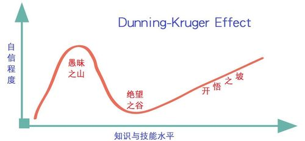

## 二十四：并发编程

推荐书籍：

1. 深入理解并发编程需要阅读 《Java concurrency in Parctice》 Brian Goetz  （该书已经有十多年的历史了）
2. 学习 JVM 推荐书籍《Inside the Java Virtual Machine》 Bill Venner

术语问题：

1. 并发：同时完成多任务，无需等待当前任务完成即可执行其他任务，**解决 I/O 密集型任务**
2. 并行：同时在多个位置完成多任务，**解决 CPU 密集型任务**

作者对于 Java 8 并发的忠告：

> 尽管 Java 8 在并发方面做出很大的改进，但仍然没有像编译时验证（compile-time verifcation）或受检查的异常（checked exceptions）那样的安全网告诉你何时出现错误。
>
> 通过并发，你只能依靠自己，只有知识渊博，保持怀疑和积极进取的人，才能用 Java 编写可靠的并发代码

### 并发为速度而生

重点摘要：

1. 不要随意使用并发编程，除非你的程序不够快，使用前要仔细思考，只有在没有选择的时候，再使用它（它并不是解决问题的首选）
2. 并发会带来成本，包括复杂性成本，但可以通过程序设计，资源平衡和用户便利性的改进来抵消 （使用复杂度来抵消复杂度）

### 四句格言

一：不要这样做

1. 如无必要，尽量不要用并发
2. 如果速度不够快，先分析它的原因，再针对性的进行优化
3. 如果逼不得已使用并发，请使用最简单和最安全的方式来解决问题（使用现有的库，而不是自己去创造）

二：没有确定性，一切可能有问题

1. 没有并发编程的世界，一切都是有序和准确的
2. 在并发的领域，一切都不会按照你期望的工作，会有很多的不确定性
3. 使用并发，你需要处理很多额外的复杂型问题，例如：处理器缓存和本地缓存的一致性，需要深入理解对象的构造，等等
4. 深入并发领域太复杂，通过《Java concurrency in Parctice》书籍可以为你提供更多专业知识

三：它起作用，并不意味着它没有问题

1. 你不能证明它是正确的，你只能证明它是不正确的
2. 如果它有问题，大多数情况下，你可能无法检测到它
3. 你不能为并发编写有效的测试，只能依靠代码检查和渊博的并发知识来发现错误
4. 进入并发编程领域容易遇到 [Dunning-Kruger 效应](https://wiki.mbalib.com/wiki/邓宁-克鲁格效应) 认知偏差，就是不熟练的人拥有着虚幻的优越感
5. 在并发领域，最糟糕的表现就是 “自信”

四：你必须仍然理解

1. 你不能逃脱使用并发，因为它无处不在，例如：Swing 界面库，Spring 框架，Tomcat 容器，或者像 Timer class 那样简单的东西，
2. 在你接触的东西里，都存在并发编程，所以你必须要理解它

### 残酷的真相

1. 在互联网的竞速比赛中，Java 的体系充斥着糟糕的决策，例如 Vector，Thread 类等等（并且只能通过建议，告诉别人不要使用这些）
2. Java 不再是为并发而设计的语言，而是一种允许并发的语言
3. Java 8 中的并行流和 CompletableFutures 是史诗级的变化

