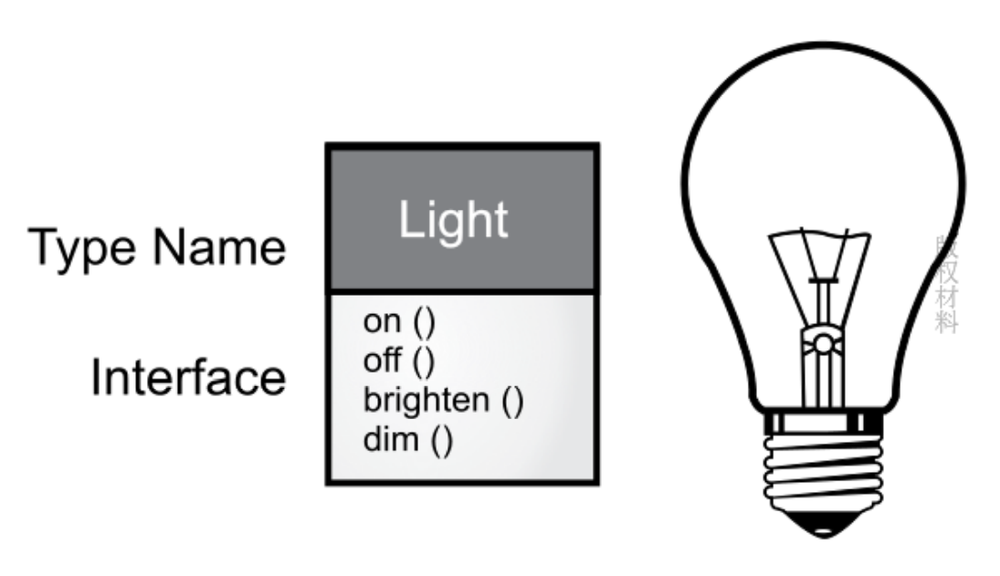

## 前言

> 语言观决定世界观 - wittgenstenin

1. Java 最核心的变化就是加入 “虚拟机” 和 “垃圾回收机制” 的概念，还推动的文档注释语法和 HTML 文档生成的工具
2. Java 8 以前的版本设计错误明显，并不尊重开发者，我一度不想跟 Java 有任何瓜葛（看来早期的 Java 语言存在很多设计问题）
3. Java 8 以后的改进都在让语言变的越来越好，在 Java 约束下可能的变的优雅，但是Java 8 为了向后兼容，所以没有出现很大的戏剧性的变化 （Java 在不停的演进，但是因为历史原因，又可能有太大的演进）

最后：

1. 本书的代码示例都保存在这个仓库：[BruceEckel/OnJava8-Examples](https://github.com/BruceEckel/OnJava8-Examples)
2. 忠告：每种语言都有其适用的业务范围，为合适的业务选择合适的编程语言，将会达到事半功倍的效果

## 对象的概念

> “我们没有意识到惯用语言的结构有多大的力量。可以毫不夸张地说，它通过语义反应机制奴役我们。语言表现出来并在无意识中给我们留下深刻印象的结构会自动投射到我们周围的世界。 ” – Alfred Korzybski (1930)  

语言方式改变人类的思维方式

### 抽象

1. 所有编程语言的都提供抽象机制，问题的负责度直接取决于抽象的类型和质量（问题越能被抽象，则越能被解决）
2. 程序员必须在机器模型和世界解决问题模型之间建立一种关联（相当于是人类世界和机器世界的翻译一样）
3. OOP 允许我们根据问题来描述问题（高级编程语言 = 以人类的思维编写指令，让机器执行）
4. `Alan Kay` 总结面向对象的五大特征：
   1. 万物皆对象（对象 = 实际领域问题的抽象模型）
   2. 程序是一组对象，通过消息传递来告知彼此该做什么（对象之间通过发送消息，相互关联）
   3. 每个对象都有自己的存储空间，可容纳其他对象（对象 = 存储）
   4. 每个对象都有一种类型（静态语言 = 显式类型，动态语言 = 隐式类型）
   5. 同一类所有对象都能接收相同的消息（相同的对象有相同的行为）

`Gardy Booch` 提供对象的简洁描述：

> 一个对象具有自己的状态，行为和表示。
>
> 一个对象有自己的内部数据，方法，并彼此区分（对象在内存中的唯一地址）

### 接口

* 第一个应用面向对象的编程语言是 Simula-67
* 每个对象都是独一无二的，它都隶属于一个特定的类，类具有自己通用特征与行为的描述
* 当我们进行面向对象的程序设计时，面临的最大一项挑战是：
  * 问题空间（问题实际存在的地方）的元素
  * 方案空间（对实际问题进行建模的地方，如计算机）的元素之间建立理想的 “一对一” 的映射关系

下图为遵循 UML 的格式，描述一个类：

* 每个类由一个框表示
* 框的顶部有类型名称
* 框中建部分是要描述的任何数据成员，
* 方法在框的地步

UML 示例：

### 服务提供

* 在开发或理解程序设计时，我们可以将对象看成是 “服务提供者”
* 将一个大问题问题一一分解，抽象成一组服务（借助思维导图等工具）
* 软件设计的基本原则是高内聚，每个组件的内部作用明确，功能紧密相关
* 良好的面向对象设计，每个对象功能单一且高效，这样的程序设计可以提高我们代码的复用性，也方便别人理解

### 封装

